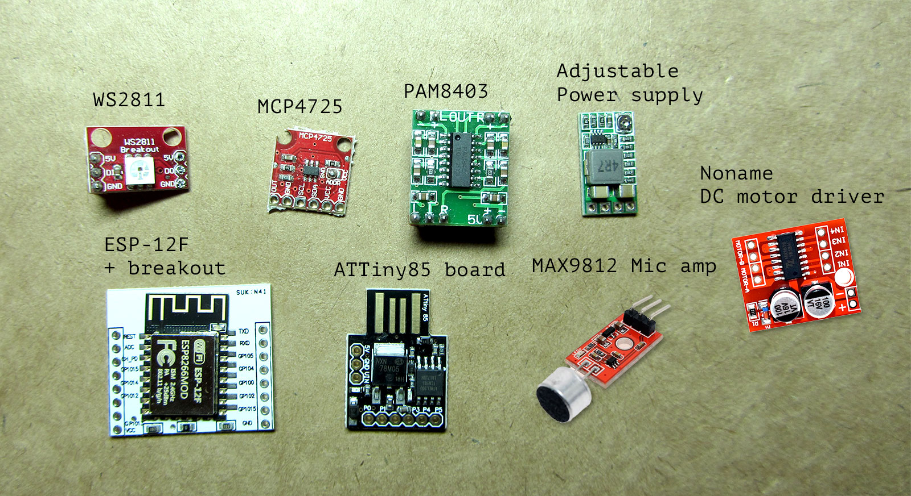
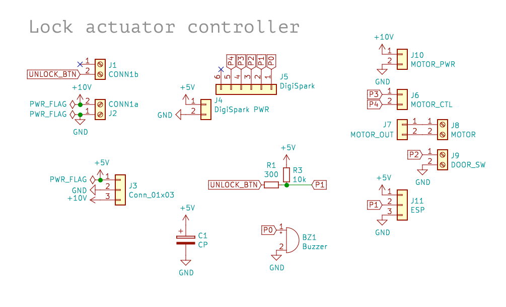
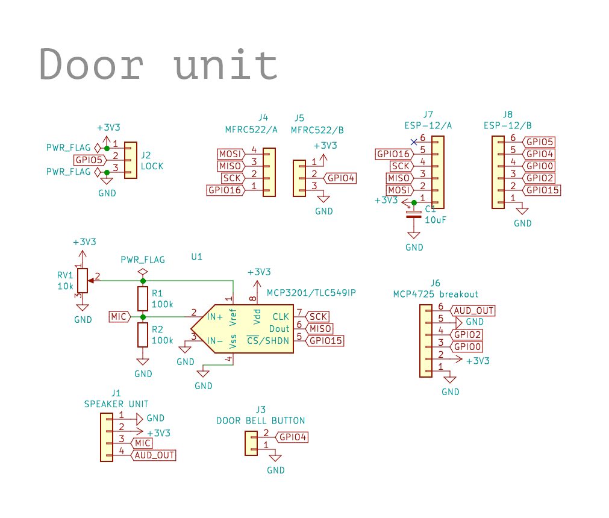
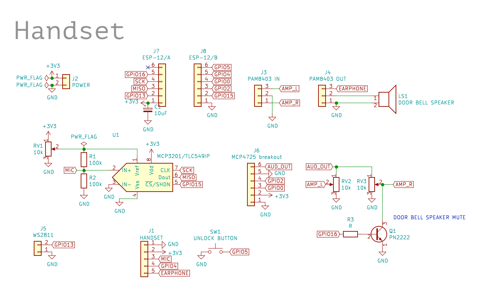

# ESP8266 door phone w/ RFID lock

> If it looks stupid but works, it ain't stupid.

Crude door phone and RFID lock project for my yard gates door.

Handset unit serves as WiFi gateway/extender creating soft AP for door unit and connecting to existing WiFi network and MQTT brocker.

Basic keys management and lock control via home assistant.

Using [PlatformIO](https://platformio.org) environment for development.

## Configuration
Create AP_credentials.h file in src dir (see doorphone.h for definitions). 

Edit mqtt_server param (without .local suffix) in settings.txt.

MQTT brocker IP address resolved via ESP8266mDNS library and requires MQTT service to be advertised.

e.g. mosquitto avahi service config: 

/etc/avahi/services/mosquitto.service
```
<!DOCTYPE service-group SYSTEM "avahi-service.dtd">
<service-group>
 <name replace-wildcards="yes">Mosquitto on %h</name>
  <service>
   <type>_mqtt._tcp</type>
   <port>1883</port>
   <txt-record>More info at mqtt.org</txt-record>
  </service>
</service-group>
```

## Hardware

As this is one time build, it's based on breakout boards/modules from ebay/aliexpress soldered to a perfboard.

Power door lock actuator unlocks a simple door bolt. Reed switch and a magnet used as door contact switch.

Initially it was very simple lock controller with one "open" button. Door phone and RFID reader were added later.

Audio quality turned out to be pretty good. There is no feedback noise due to earphone on the handset side. To get rid of digital noise and echo use shielded cable for microphone signal.

### Breakout boards/modules

MFRC522 reader missing here, any RC522 with SPI interface should work.

MCP3021 or TLC549 ADC can be used, add "ADC8BIT" define to build flags in case of TLC549 (see platformio.ini).




### Schematics








# WARNING
This implementation of RFID access control isn't even remotely secure and should not be used in any critical situation!

## Audio sources from freesound.org:

- Success: [https://freesound.org/people/grunz/sounds/109662/](https://freesound.org/people/grunz/sounds/109662/)

- Error: [https://freesound.org/people/Breviceps/sounds/445978/](https://freesound.org/people/Breviceps/sounds/445978/)

- Door bell: [https://freesound.org/people/pac007/sounds/331567/](https://freesound.org/people/pac007/sounds/331567/)

